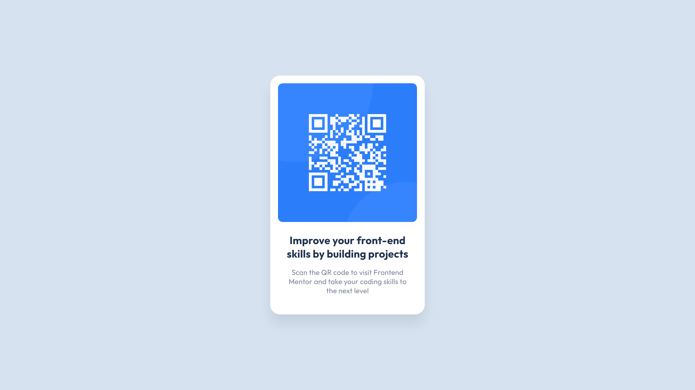

# Frontend Mentor - QR code component solution

> This is a solution to the [QR code component challenge on Frontend Mentor](https://www.frontendmentor.io/challenges/qr-code-component-iux_sIO_H).

## Overview

## My process

> ♻ Update: Refactored code and added responsiveness

Decided to refactor this project and use CSS `grid` instead of `flex`.

### Built with

- HTML
- CSS

### Links

- Solution URL: [https://www.frontendmentor.io/solutions/qr-code-component-html-css-a-WSl-ddwv](https://www.frontendmentor.io/solutions/qr-code-component-html-css-a-WSl-ddwv)
- Live Site URL: [https://phislipe.github.io/qr-code-component](https://phislipe.github.io/qr-code-component)

## Author

- 🌐 Website - [phislipe.dev](https://phislipe.dev)
- 🪪 LinkedIn - [Philipe Rocha](https://www.linkedin.com/in/phislipe/)
