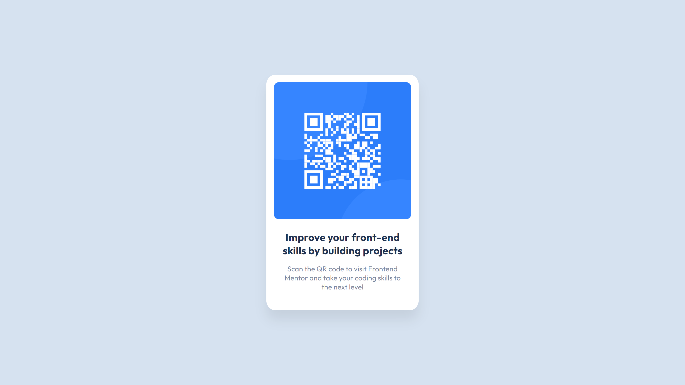

<h1 align="center">
  
</h1>

  This is a solution to the <a href="https://www.frontendmentor.io/challenges/qr-code-component-iux_sIO_H">QR code component challenge on Frontend Mentor</a>.

<h3 align="center">
  QR Code Component #️⃣
</h3>

  

<h2>📋 The challenge</h2>

The challenge was to build out this QR code component and get it looking as close to the design as possible.

Users should be able to:

- View the optimal layout depending on their device's screen size
- See hover and focus states for interactive elements

 

<h3>🧪 Built with</h3>

- HTML
- CSS

<h3>🔗 Links</h3>

- Solution URL: [https://www.frontendmentor.io/solutions/qr-code-component-html-css-a-WSl-ddwv](https://www.frontendmentor.io/solutions/qr-code-component-html-css-a-WSl-ddwv)
- Live Site URL: [https://phislipe.github.io/qr-code-component](https://phislipe.github.io/qr-code-component)

---

  Made by <a href="https://phislipe.dev"><b>Philipe Rocha</b></a>

